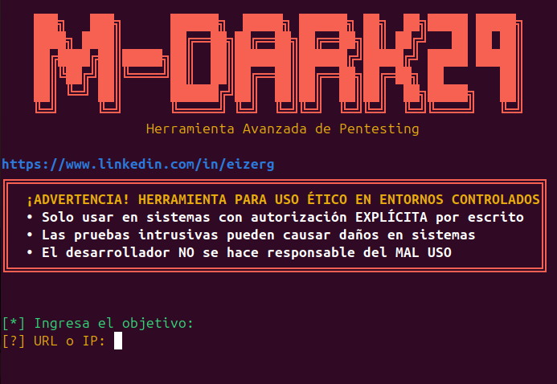

  

1er paso crear entorno virtual  
python3 -m venv venv  

2do paso activar el entorno  
En Linux/macOS  
source venv/bin/activate  
  
En Windows  
venv\Scripts\activate  

3er paso instslar dependencias  
pip install --upgrade pip  
pip install -r requirements.txt  

---
Configuración general
DEBUG=False
LOG_LEVEL=INFO

---
Configuración de proxies (opcional)
HTTP_PROXY=http://localhost:8080
HTTPS_PROXY=http://localhost:8080

# Configuración de tiempos de espera
REQUEST_TIMEOUT=30
CONNECTION_TIMEOUT=10

# Configuración de usuario-agente
USER_AGENT=Mozilla/5.0 (Windows NT 10.0; Win64; x64) AppleWebKit/537.36

# Credenciales para pruebas (usar con precaución)
TEST_USERNAME=test
TEST_PASSWORD=password123

Permisos Necesarios:
Linux:
bash
# Dar permisos de ejecución
chmod +x M-dark29.py

# Instalar como herramienta del sistema (opcional)
sudo cp M-dark29.py /usr/local/bin/mdark
sudo chmod +x /usr/local/bin/mdark

⚠️ Nota de Ética y Responsabilidad
Este proyecto es un aporte con fines estrictamente educativos y profesionales. La automatización aumenta la velocidad, pero también la responsabilidad. Utiliza este script únicamente en entornos controlados o bajo autorización explícita del propietario del sistema.

El conocimiento es libre, la intrusión sin permiso es un delito.

https://lnkd.in/ewnS7hFS
https://lnkd.in/eQCEkR4e
hashtag#pentesting hashtag#hackingetico hashtag#seguridad hashtag#informatica
